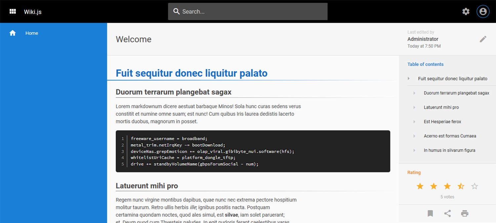

<!--
N.B.: This README was automatically generated by https://github.com/YunoHost/apps/tree/master/tools/README-generator
It shall NOT be edited by hand.
-->

# Wiki.js pour YunoHost

[](https://dash.yunohost.org/appci/app/wikijs)    
[](https://install-app.yunohost.org/?app=wikijs)

*[Read this readme in english.](./README.md)*

> *Ce package vous permet d'installer Wiki.js rapidement et simplement sur un serveur YunoHost.
Si vous n'avez pas YunoHost, regardez [ici](https://yunohost.org/#/install) pour savoir comment l'installer et en profiter.*

## Vue d'ensemble

Wiki.js is a copylefted libre software, modern and powerful wiki app built on Node.js, Git and Markdown for YunoHost.


**Version incluse :** 2.5.283~ynh1

**Démo :** https://docs-beta.requarks.io/

## Captures d'écran




## Avertissements / informations importantes

* **Wiki.js** requires a dedicated **root domain**, e.g. wikijs.domain.tld
* LDAP is implemented, root will receive an e-mail at the end of the installation or the upgrade with the info on how to configure LDAP.
* No HTTP auth for now, but planned for the future.

## Documentations et ressources

* Site officiel de l'app : <https://wiki.js.org/>
* Documentation officielle utilisateur : <https://docs-beta.requarks.io/>
* Documentation officielle de l'admin : <https://yunohost.org/en/app_wikijs>
* Dépôt de code officiel de l'app : <https://github.com/Requarks/wiki>
* Documentation YunoHost pour cette app : <https://yunohost.org/app_wikijs>
* Signaler un bug : <https://github.com/YunoHost-Apps/wikijs_ynh/issues>

## Informations pour les développeurs

Merci de faire vos pull request sur la [branche testing](https://github.com/YunoHost-Apps/wikijs_ynh/tree/testing).

Pour essayer la branche testing, procédez comme suit.

``` bash
sudo yunohost app install https://github.com/YunoHost-Apps/wikijs_ynh/tree/testing --debug
ou
sudo yunohost app upgrade wikijs -u https://github.com/YunoHost-Apps/wikijs_ynh/tree/testing --debug
```

**Plus d'infos sur le packaging d'applications :** <https://yunohost.org/packaging_apps>
