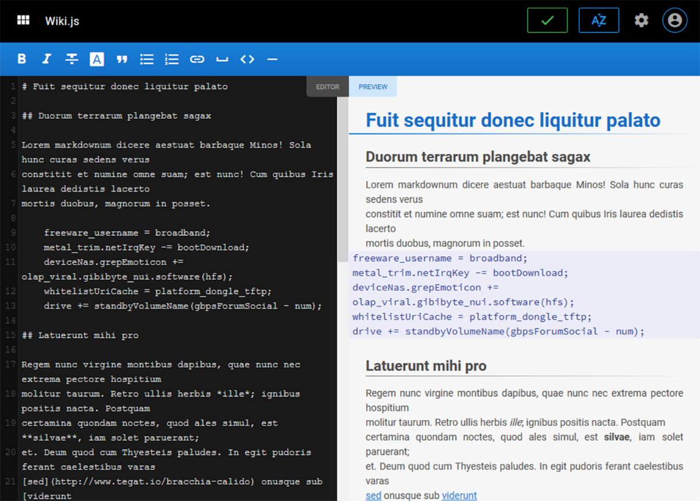

<!--
To README zostało automatycznie wygenerowane przez <https://github.com/YunoHost/apps/tree/master/tools/readme_generator>
Nie powinno być ono edytowane ręcznie.
-->

# Wiki.js dla YunoHost

[](https://ci-apps.yunohost.org/ci/apps/wikijs/)


[](https://install-app.yunohost.org/?app=wikijs)

*[Przeczytaj plik README w innym języku.](./ALL_README.md)*

> *Ta aplikacja pozwala na szybką i prostą instalację Wiki.js na serwerze YunoHost.*  
> *Jeżeli nie masz YunoHost zapoznaj się z [poradnikiem](https://yunohost.org/install) instalacji.*

## Przegląd

Wiki.js is a copylefted libre software, modern and powerful wiki app built on Node.js, Git and Markdown for YunoHost.


**Dostarczona wersja:** 2.5.306~ynh1

**Demo:** <https://docs-beta.requarks.io/>

## Zrzuty ekranu



## Dokumentacja i zasoby

- Oficjalna strona aplikacji: <https://wiki.js.org/>
- Oficjalna dokumentacja: <https://docs-beta.requarks.io/>
- Repozytorium z kodem źródłowym: <https://github.com/Requarks/wiki>
- Sklep YunoHost: <https://apps.yunohost.org/app/wikijs>
- Zgłaszanie błędów: <https://github.com/YunoHost-Apps/wikijs_ynh/issues>

## Informacje od twórców

Wyślij swój pull request do [gałęzi `testing`](https://github.com/YunoHost-Apps/wikijs_ynh/tree/testing).

Aby wypróbować gałąź `testing` postępuj zgodnie z instrukcjami:

```bash
sudo yunohost app install https://github.com/YunoHost-Apps/wikijs_ynh/tree/testing --debug
lub
sudo yunohost app upgrade wikijs -u https://github.com/YunoHost-Apps/wikijs_ynh/tree/testing --debug
```

**Więcej informacji o tworzeniu paczek aplikacji:** <https://yunohost.org/packaging_apps>
